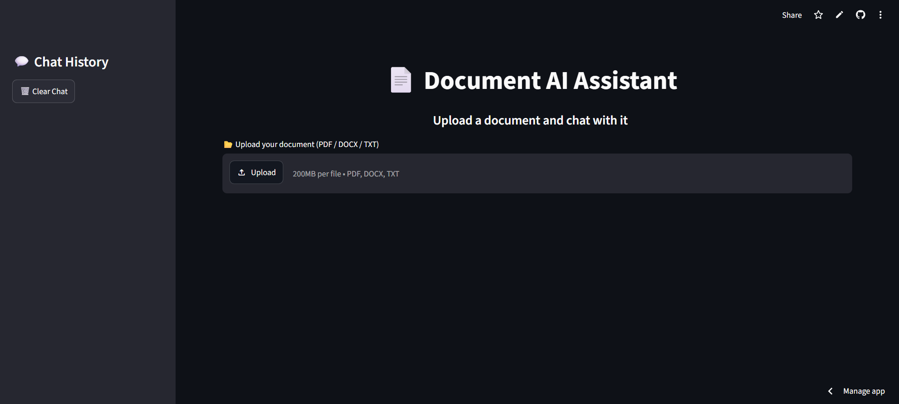
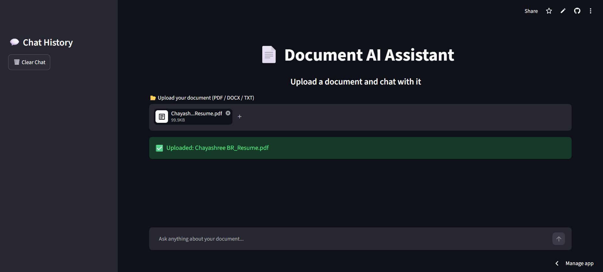

# Document AI RAG

An AI-powered Retrieval-Augmented Generation (RAG) application that enables users to upload documents and ask natural language questions. The system retrieves the most relevant document chunks using semantic search and generates context-aware answers using a Large Language Model (LLM).

## Features
- Upload PDF and DOCX documents
- Automatic document parsing and text chunking
- Semantic search using vector embeddings
- Retrieval-Augmented Generation (RAG)
- Context-aware question answering
- Interactive Streamlit web interface
  
## Tech Used

- Language: Python
- Framework: Streamlit
- LLM: Groq API
- Vector Database: FAISS
- Embeddings: Sentence Transformers
- Document Processing: PyPDF, python-docx
- Libraries: NumPy
  
## Project Workflow

- Upload a document.
- Extract text from the document.
- Split the text into smaller chunks.
- Generate embeddings for each chunk.
- Store embeddings in a FAISS vector database.
- Retrieve the most relevant chunks based on the user's question.
- Send the retrieved context to the LLM.
- Display an accurate, context-aware answer.

## Skills Demonstrated

- Retrieval-Augmented Generation (RAG)
- Large Language Models (LLMs)
- Prompt Engineering
- Semantic Search
- Vector Databases
- Embeddings
- Information Retrieval
- Python Development
  
## Run Project

```bash
pip install -r requirements.txt
streamlit run app.py
```

## Live Demo

Try the app here:
https://document-ai-rag-dcimty3oprqrzwys4j74ye.streamlit.app/

## Screenshots
### Home Page



### Upload Document



### Ask Questions


### Another Example


